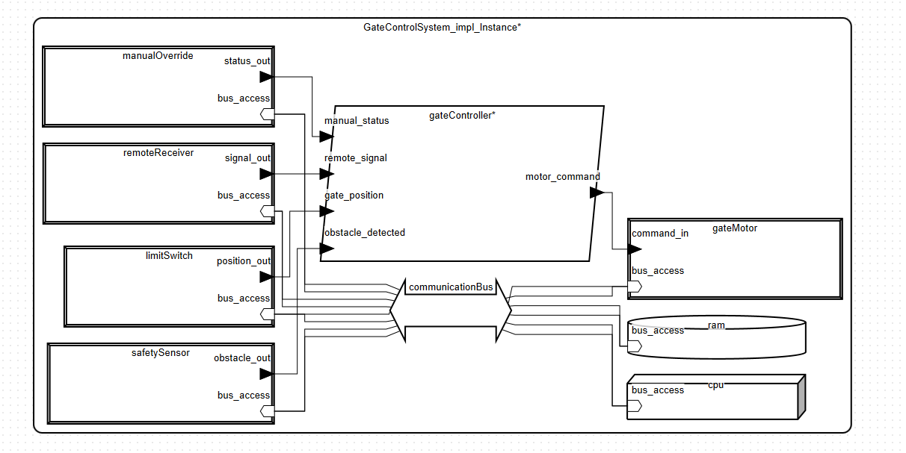
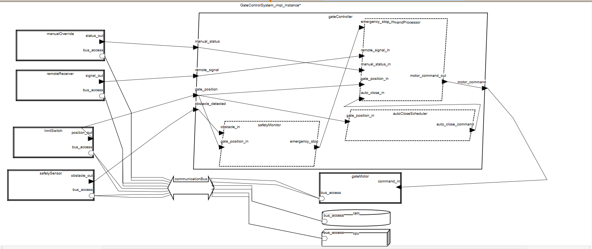
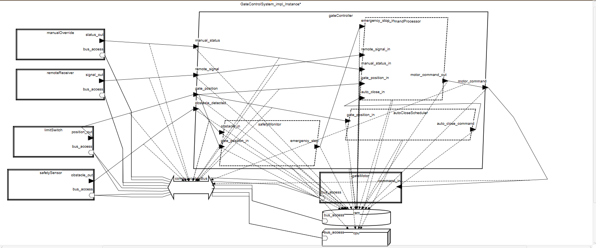
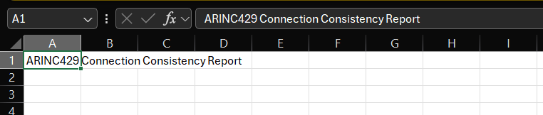
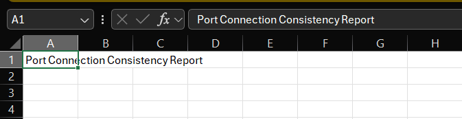
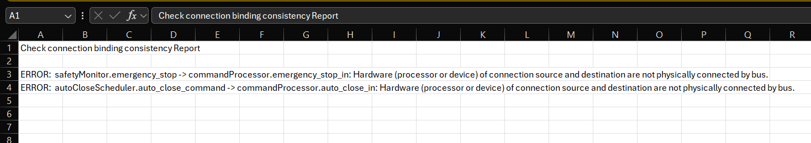
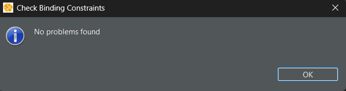
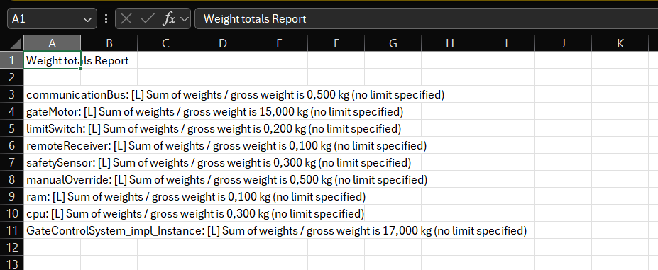

# Systemy Czasu Rzeczywistego – Projekt

## 1. Tytuł modelu
**System sterowania bramą wjazdową**

## 2. Autor
**Filip Bieńkowski**  
fbienkowski@student.agh.edu.pl

---

## 3. Opis modelowanego systemu

System kontroli bramy automatycznej to zintegrowany system embedded odpowiedzialny za bezpieczne i automatyczne zarządzanie bramą wjazdową. Obsługuje sterowanie pilotem, wykrywanie przeszkód, automatyczne zamykanie oraz tryb ręczny.

Model został zaprojektowany z uwzględnieniem wymagań czasu rzeczywistego i bezpieczeństwa funkcjonalnego.

---

## 4. Opis ogólny

### Architektura systemu

System zbudowany jest w oparciu o architekturę warstwową:

- Warstwa aplikacyjna – procesy sterujące (`GateController`)
- Warstwa urządzeń – czujniki i aktuatory (`GateMotor`, `SafetySensor`, itp.)
- Warstwa sprzętowa – procesor, pamięć, magistrala komunikacyjna

### Główne funkcjonalności

- Sterowanie zdalne – obsługa sygnałów z pilota
- Monitoring bezpieczeństwa – detekcja przeszkód
- Automatyczne zamykanie – po zadanym czasie
- Tryb ręczny – możliwość ręcznego przejęcia kontroli
- Kontrola pozycji – śledzenie stanu bramy

### Wymagania czasowe

System działa w czasie rzeczywistym z cyklami:

- Najkrótszy: 20 ms (dla `SafetySensor`)
- Najdłuższy: 1000 ms (dla `AutoCloseScheduler`)

Szeregowanie realizowane algorytmem RMS (Rate Monotonic Scheduling).

---

## 5. Opis dla użytkownika

### Jak używać systemu

- Zdalne sterowanie – naciśnij przycisk na pilocie, aby otworzyć lub zamknąć bramę
- Automatyczne zamykanie – brama zamyka się automatycznie po ustalonym czasie
- Wykrywanie przeszkód – brama zatrzymuje się w razie wykrycia przeszkody
- Tryb ręczny – możliwe sterowanie ręczne w przypadku awarii

### Stany bramy

- `Closed` – brama zamknięta
- `Opening` – brama w trakcie otwierania
- `Open` – brama otwarta
- `Closing` – brama w trakcie zamykania
- `Stopped` – brama zatrzymana (np. przez przeszkodę)

### Komendy sterujące

- `Open` – otwórz bramę
- `Close` – zamknij bramę
- `Stop` – zatrzymaj bramę

---

## 6. Komponenty systemu

| **Komponent**            | **Typ**                  | **Opis**                                                                 |
|--------------------------|---------------------------|--------------------------------------------------------------------------|
| `GateControlSystem`      | `system`                  | Główna jednostka zarządzająca całością działania bramy.                 |
| `CommandProcessor`       | `process/thread`          | Przetwarza komendy otwarcia, zamknięcia i zatrzymania.                  |
| `GateMotor`              | `device`                  | Wykonuje ruchy fizyczne bramy. Wysyła komendy co 100ms.                 |
| `LimitSwitch`            | `device`                  | Odczytuje pozycję bramy (otwarta/zamknięta), cyklicznie co 50ms.        |
| `SafetySensor`           | `device`                  | Wykrywa przeszkody na drodze bramy, odświeżany co 20ms.                 |
| `RemoteControlReceiver`  | `device`                  | Odbiera sygnały z pilota – otwarcie, zatrzymanie, zamknięcie.          |
| `ManualOverride`         | `device`                  | Pozwala użytkownikowi ręcznie kontrolować bramę.                        |
| `AutoCloseScheduler`     | `thread/process`          | Harmonogram zamykania bramy automatycznie po czasie.                    |
| `SafetyMonitor`          | `thread/process`          | Monitoruje warunki bezpieczeństwa, wyzwala `emergency_stop`.           |
| `CPU`                    | `processor`               | Jednostka wykonawcza całego systemu.                                     |
| `RAM`                    | `memory`                  | Pamięć operacyjna do przechowywania stanu i danych tymczasowych.        |
| `CommunicationBus`       | `bus`                     | Magistrala komunikacyjna łącząca komponenty systemu.                    |

### Typy danych

- `GateCommand` – komendy sterujące bramą
- `GatePosition` – stany pozycji bramy
- `ObstacleDetected` – sygnał przeszkody (boolean)

### System główny

`system implementation GateControlSystem.impl` zawiera:

- `gateController` – proces sterujący
- `gateMotor` – silnik bramy
- `limitSwitch` – czujniki krańcowe
- `remoteReceiver` – odbiornik pilota
- `safetySensor` – czujnik bezpieczeństwa
- `manualOverride` – przełącznik trybu ręcznego
- `cpu` – procesor
- `ram` – pamięć RAM
- `communicationBus` – magistrala komunikacyjna

### Procesy i wątki

- `GateController` – główny proces logiki sterującej
  - `CommandProcessor` – przetwarzanie komend (100 ms)
  - `SafetyMonitor` – nadzór bezpieczeństwa (50 ms)
  - `AutoCloseScheduler` – automatyczne zamykanie (1000 ms)

### Urządzenia

- `GateMotor` – silnik (waga 15 kg)
- `SafetySensor` – czujnik przeszkód (okres 20 ms)
- `RemoteControlReceiver` – odbiornik pilota (sporadyczne zdarzenia)

### Sprzęt

- `CPU` – 100 MIPS, algorytm RMS
- `CommunicationBus` – przepustowość 10 MB/s

---

## 7. Model – diagramy

### Wersja 1 – pierwotna

### Wersja 2 – po dodaniu brakujących komponentów

### Wersja 3 – po dodaniu bindingów

---
## 8. Proponowane metody analizy modelu, dostępne w OSATE. Wyniki przeprowadzonych analiz

W celu weryfikacji poprawności modelu przeprowadzono szereg analiz przy użyciu narzędzia OSATE:

### 8.1 Analiza spójności połączeń (Connection Consistency)

Sprawdzenie poprawności i kompletności połączeń między komponentami systemu.

**Wynik:**

---

### 8.2 Analiza spójności portów (Port Connection Consistency)

Weryfikacja, czy połączenia portów typu `in` i `out` są zgodne i poprawnie zdefiniowane.

**Wynik:**

---

### 8.3 Analiza spójności powiązań (Connection Binding Consistency)

Sprawdzenie poprawności wiązań (bindingów) komponentów do sprzętu (np. procesora, pamięci).

**Wynik:**

---

### 8.4 Weryfikacja ograniczeń powiązań (Check Binding Constraints)

Analiza poprawności narzuconych ograniczeń powiązań (`Actual_Processor_Binding`, `Actual_Memory_Binding`, itp.).

**Wynik:**

---

### 8.5 Analiza wag komponentów (Weight Analysis)

Sprawdzenie poprawności przypisanych wag komponentów fizycznych (urządzeń i sprzętu).

**Wynik:**

---

